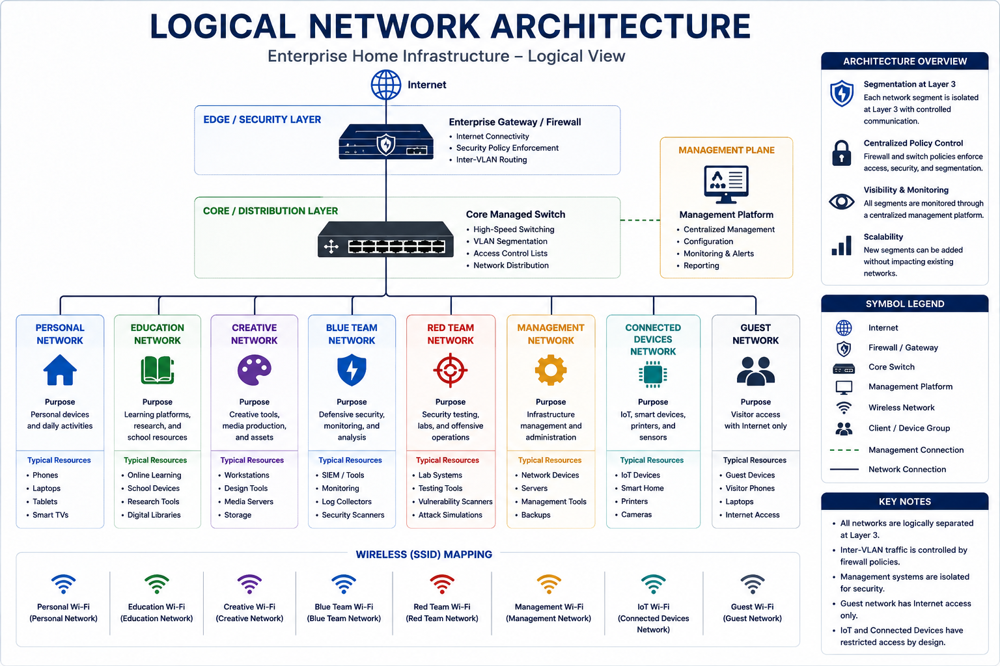
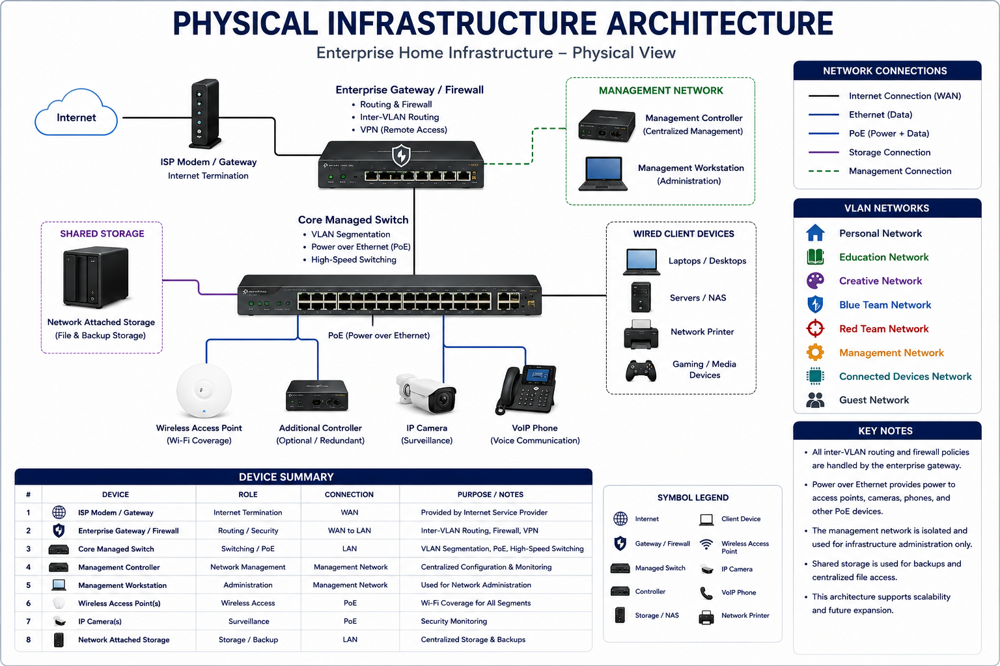
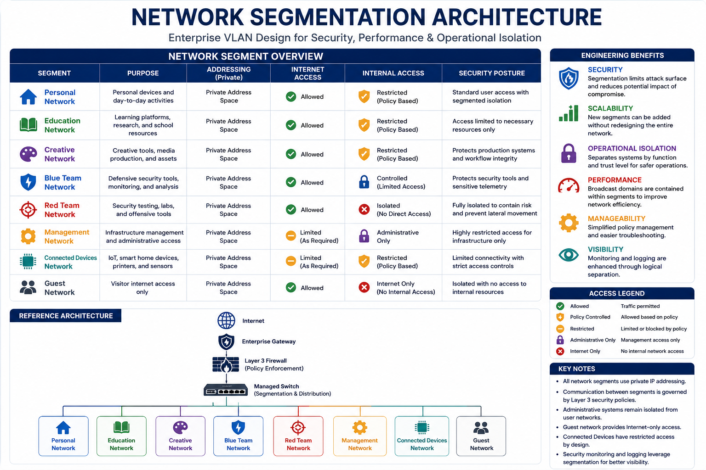

<h1 align="center">Enterprise Home Infrastructure</h1>

<h3 align="center">
Enterprise-Inspired Network Architecture Project
</h3>

<p align="center">

Designing, securing, operating, monitoring, and documenting an enterprise-inspired home infrastructure using modern networking, cybersecurity, and IT operations best practices.

</p>

<p align="center">


</p>

---

# Architecture Gallery

| Logical Architecture | Physical Architecture |
|----------------------|-----------------------|
|  |  |

| Network Segmentation | Traffic Flow |
|----------------------|--------------|
|  |  |

# Overview

Enterprise Home Infrastructure is a long-term engineering project that demonstrates the design, implementation, operation, and continuous improvement of an enterprise-inspired network.

Rather than simply building a functional home network, this project applies enterprise architecture principles to create a secure, segmented, monitored, and well-documented environment similar to those found in professional IT organizations.

This repository focuses not only on technical implementation but also on the operational practices that keep enterprise infrastructure reliable over time.

---

### Why This Project?

This project was built to gain practical experience in the responsibilities commonly performed by:

- Network Engineers
- Infrastructure Engineers
- Systems Administrators
- Security Engineers
- Blue Team Analysts

The objective was to move beyond individual technologies and understand how networking, security, monitoring, documentation, disaster recovery, and operations work together as a complete infrastructure.

---

# Enterprise Features

| Category | Implementation |
|:--|:--|
| Network Architecture | Enterprise-inspired layered network design |
| Segmentation | Multi-VLAN architecture |
| Security | Layer 3 firewall policies & least privilege |
| Wireless | Enterprise Wi-Fi with segmented SSIDs |
| Administration | Dedicated management network |
| Monitoring | Omada SDN & Wazuh SIEM |
| Recovery | Backup & disaster recovery planning |
| Documentation | 18 engineering guides & operational runbooks |
| Operations | Preventive maintenance & change management |

---

# Architecture

```text
                    Internet
                        │
                   ISP Gateway
                        │
                Enterprise Router
                        │
                Managed PoE Switch
         ┌──────────────┼──────────────┐
         │              │              │
    Omada SDN      Access Point   Wired Devices
     Controller
                        │
                Enterprise VLAN Fabric
```


### Future Network Design: Bridge Mode Plan
During the initial rollout, the ISP gateway will remain in router mode while the ER605 operates behind it in a temporary Double NAT / NAT x2 design. This provides a safer migration path, keeps a fallback connection available, and allows VLANs, routing, DHCP, DNS, firewall rules, management access, and recovery procedures to be validated before bridge mode is enabled.

For the full decision record and rollout plan, see: [Bridge Mode-Plan](docs/bridge-mode-decision.md)

---

# Engineering Principles

Every design decision throughout this project follows the same engineering principles.

- Security by Design
- Defense in Depth
- Least Privilege
- Network Segmentation
- Operational Simplicity
- Documentation First
- Continuous Improvement

These principles guided every stage of planning, deployment, validation, and maintenance.

---

# [Documentation](https://github.com/khucker3d/enterprise-infrastructure-architecture-public/tree/main/docs)
**Documentation Scope:** This public repository contains a high-level, sanitized overview of the project. More detailed internal documentation exists separately, including step-by-step walkthroughs, configuration procedures, validation steps, troubleshooting notes, and operational runbooks. Sensitive environment-specific details have been intentionally excluded for security reasons.*

### Security

- Firewall Policy Overview
- Security Hardening

### Operations

- Monitoring & Logging
- Backup & Recovery
- Disaster Recovery & Business Continuity
- Maintenance & Operations

### Engineering

- Troubleshooting Highlights
- Lessons Learned
- Skills Demonstrated
- Change History

---

# Technologies

### Networking

- TP-Link Omada SDN
- Enterprise Router
- Managed PoE Switching
- Wi-Fi 6
- VLAN Segmentation

### Security

- Layer 3 Firewall Policies
- Network Segmentation
- Defense in Depth
- Least Privilege

### Monitoring

- Wazuh SIEM
- Omada Controller
- Infrastructure Monitoring

### Infrastructure

- Windows 11 Pro
- Ubuntu Server
- Kali Linux
- VMware Workstation

---

# Project Roadmap

## Completed

- Enterprise Architecture
- Secure VLAN Design
- Firewall Deployment
- Wireless Architecture
- Monitoring Strategy
- Disaster Recovery Planning
- Operations Manual
- Maintenance Framework

## Planned Ideas

- Bridging
- Infrastructure Automation
- Internal PKI
- Network Access Control
- Synology NAS Integration
- UPS Deployment
- Infrastructure as Code
- Python Administration Toolkit

---

# Repository Structure

```text
enterprise-home-infrastructure/

├── README.md
├── docs/
├── LICENSE
└── CHANGELOG.md
```

---

# Notes

This repository has been intentionally sanitized for public release.

Sensitive information has been removed or replaced, including:

- IP addresses
- Hostnames
- SSIDs
- MAC addresses
- Device serial numbers
- Administrative credentials
- Physical location details

The goal is to demonstrate engineering practices while protecting operational security.

---

# Skills Demonstrated

| Engineering Discipline | Practical Experience |
|:--|:--|
| Network Engineering | VLAN Design, Routing, Switching, DHCP, DNS |
| Network Security | Firewall Policies, ACL Design, Defense in Depth |
| Wireless Networking | Enterprise Wi-Fi Design & Client Segmentation |
| Infrastructure | Omada SDN, Windows, Linux, VMware |
| Monitoring | Wazuh SIEM, Infrastructure Health Monitoring |
| Operations | Change Management, Preventive Maintenance |
| Disaster Recovery | Backup Strategy, Recovery Validation |
| Technical Documentation | SOPs, Runbooks, Architecture Documentation |

---

<p align="center">

**Designed with enterprise engineering principles. Built for continuous learning.**

</p>
